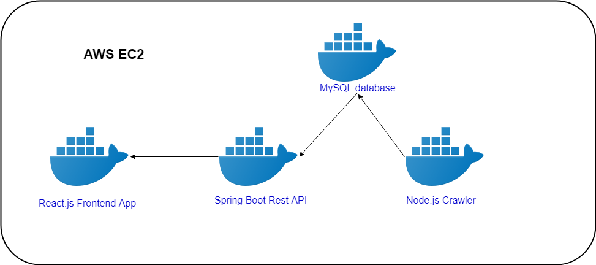

# Immoscout Crawler

This is a microservices based solution to get the price information from [immobilienscout24.de](https://www.immobilienscout24.de)  web site

## Architecture
The solution consists of 4 microservices running in the docker containers. All docker containers are hosted on a single free tier AWS EC2 instance

## Configuration
Microservices communication and setup is configured via `docker-compose.yaml` file in the root folder.
Everything in that file can be left as-is except for the database password configured via `MYSQL_ROOT_PASSWORD` environmental variable.  

Immoscout crawling service is configured via `config.yaml` file. The template of this file is placed in the 'immoscout-crawler' root folder.  
There are two ways to use this configuration file:
1.	Put it into the `defaultConfigFile` folder and build the docker image.  
2.	Put the file into the host machine (EC2) in the folder mapped via `docker-compose.yaml`. in this example it is `/home/ec2-user/crawlerConfig` folder. It should be changed if other than AWS provider is used. 

The second option take precedence over the first one.

## Running
- Make sure that all three docker images are build and available in your docker host. MySQL container is created out of official MySQL image that is pulled directly from the docker hub. 
- Make sure `immoscout-crawler` service is properly configured as described above. 
- Make sure `docker-compose` is installed.
- In your host instance run `docker-compose up -d` from the folder where `docker-compose.yaml` is available.

## Demo
The working solution is available at this [link]( http://ec2-18-184-1-164.eu-central-1.compute.amazonaws.com)